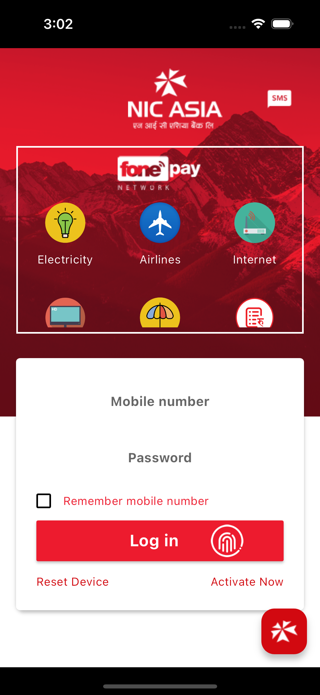

# NIC ASIA Bank Clone App

Welcome to the NIC ASIA Bank Clone App, a Flutter UI challenge to replicate the NIC ASIA Bank app. This project demonstrates a responsive UI design using Flutter.

## 🌟 Features

- **Responsive UI:** Adapts seamlessly to different screen sizes.
- **Beautiful Design:** Closely replicates the NIC ASIA Bank app interface.
- **Profile Integration:** Custom profile image widget.

## 🛠️ What's Implemented

- Responsive layouts
- Login screen UI
- Account details section

## 📱 DEMO/Screenshots


### Login Screen



## 🚀 Getting Started

To get a local copy up and running, follow these steps.

### Prerequisites

- Flutter SDK
- A suitable IDE (VS Code, Android Studio, etc.)

### Installation

1. Clone the repo:

   ```sh
   git clone https://github.com/your-username/nic-asia-bank-clone.git

2. Navigate to the project directory:

   ```sh
   cd nic-asia-bank-clone

3. Install dependencies:

  ```sh
  flutter pub get

4. Run the app:

  ```sh
  flutter run

## 🏆 Credits
This UI sample is taken from the NIC ASIA Bank app available on the Google Play Store.

## 👨‍💻 Author

 Aayush D.C Dangi - Twitter

## 📄 License

This project is licensed under the MIT License - see the [License](LICENSE) file for details.

© 2024 Aayush D.C Dangi
